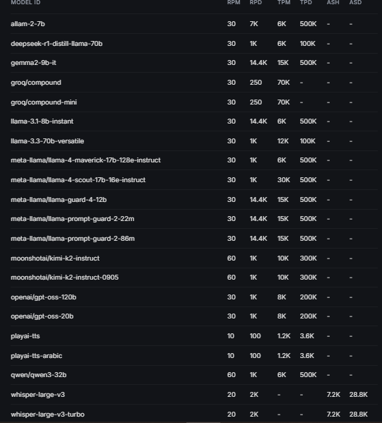
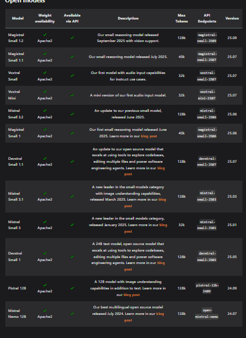

**NVIDIA DeepSeek with NEW API provider example code (Node.js)**

```javascript

import OpenAI from 'openai';

const openai = new OpenAI({
  apiKey: '$API_KEY_REQUIRED_IF_EXECUTING_OUTSIDE_NGC',
  baseURL: 'https://integrate.api.nvidia.com/v1',
})
 
async function main() {
  const completion = await openai.chat.completions.create({
    model: "deepseek-ai/deepseek-r1",
    messages: [{"role":"user","content":""}],
    temperature: 0.6,
    top_p: 0.7,
    max_tokens: 4096,
    stream: false
  })
   
  const reasoning = completion.choices[0]?.message?.reasoning_content;
  if (reasoning) process.stdout.write(reasoning + "\n");
  process.stdout.write(completion.choices[0]?.message?.content);
  
}

main();


**for grok rate limits**
 

 **for cerebras with NEW API provider example code (Node.js)**

import Cerebras from '@cerebras/cerebras_cloud_sdk';

const cerebras = new Cerebras({
  apiKey: process.env['CEREBRAS_API_KEY']
  // This is the default and can be omitted
});

async function main() {
  const stream = await cerebras.chat.completions.create({
    messages: [
        {
            "role": "system",
            "content": ""
        }
    ],
    model: 'qwen-3-235b-a22b-instruct-2507',
    stream: true,
    max_completion_tokens: 20000,
    temperature: 0.7,
    top_p: 0.8
  });

  for await (const chunk of stream) {
    process.stdout.write(chunk.choices[0]?.delta?.content || '');
  }
}

main();

**for mistral rate limits**
