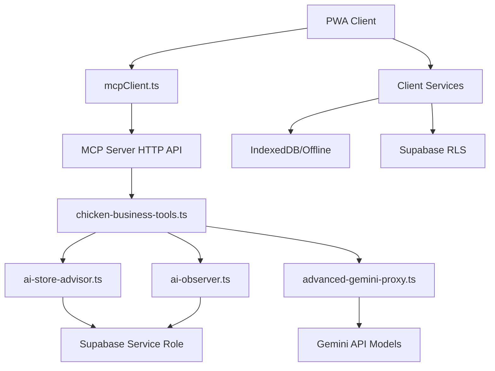

# MCP Server Build Fix Guide

## 🎯 Executive Summary

The MCP server has **51 TypeScript errors** across 11 files that need to be resolved. These errors fall into three main categories:

1. **Missing service files** that should not be in the MCP server
2. **Import path issues** from service migration
3. **Type declaration problems** from missing dependencies

## 🔍 Error Analysis

### 📊 **Error Distribution**

| File | Errors | Category | Action Required |
|------|---------|----------|-----------------|
| `chickenBusinessAI.ts` | 15 | ❌ Should be client-side | Remove from MCP server |
| `AIAgentService.ts` | 7 | ❌ Should be client-side | Remove from MCP server |
| `embeddingService.ts` | 7 | ❌ Should be client-side | Remove from MCP server |
| `salesService.ts` | 5 | ❌ Should be client-side | Remove from MCP server |
| `expenseService.ts` | 4 | ❌ Should be client-side | Remove from MCP server |
| `productService.ts` | 3 | ❌ Should be client-side | Remove from MCP server |
| `chicken-business-tools.ts` | 3 | 🔧 Fix imports | Update import paths |
| `aiStoreAdvisor.ts` | 2 | 🔧 Fix imports | Remove client dependencies |
| `stockService.ts` | 2 | ❌ Should be client-side | Remove from MCP server |
| `summaryService.ts` | 2 | ❌ Should be client-side | Remove from MCP server |
| `geminiAPIManager.ts` | 1 | ❌ Replaced by Advanced Proxy | Remove from MCP server |

## 🚨 **Critical Issue: Wrong Services in MCP Server**

### ❌ **Services That Don't Belong in MCP Server**

These services are **client-side** and should NOT be in the MCP server:

```bash
# Remove these files from mcp-server/src/services/:
- AIAgentService.ts           # Client-side AI agent
- chickenBusinessAI.ts        # Client-side business AI  
- embeddingService.ts         # Client-side embedding service
- expenseService.ts           # Client RLS operations
- geminiAPIManager.ts         # Replaced by AdvancedGeminiProxy
- productService.ts           # Client RLS operations
- salesService.ts             # Client RLS operations
- stockService.ts             # Client-side stock operations
- summaryService.ts           # Client-side summary service
```

**Why they don't belong:**
- They import client-side services (`offlineService`, `supabaseConfig`)
- They use browser APIs (`import.meta.env`)
- They handle Row Level Security (RLS) operations
- They manage IndexedDB and offline functionality

## 🛠️ **Step-by-Step Fix Instructions**

### **Step 1: Remove Client-Side Services from MCP Server**

```bash
# Navigate to MCP server services directory
cd /workspaces/Charnoksv3/mcp-server/src/services

# Remove client-side services (these belong in /workspaces/Charnoksv3/services/)
rm -f AIAgentService.ts
rm -f chickenBusinessAI.ts  
rm -f embeddingService.ts
rm -f expenseService.ts
rm -f geminiAPIManager.ts
rm -f productService.ts
rm -f salesService.ts
rm -f stockService.ts
rm -f summaryService.ts

# Keep only true server-side services:
# ✅ ai-store-advisor.ts    (Server-side business consultant)
# ✅ ai-observer.ts         (Server-side analytics)
```

### **Step 2: Fix Import Paths in Remaining Services**

#### **Fix `ai-store-advisor.ts`**
```typescript
// Remove this problematic import
// import { offlineDB } from './offlineService';

// Replace offlineDB usage with Supabase calls
// Instead of: const memories = await offlineDB.getAll('business_memory');
// Use: const { data: memories } = await this.supabase.from('business_memory').select('*');
```

#### **Fix `chicken-business-tools.ts`**
```typescript
// Current (broken):
import AIStoreAdvisorService from '../services/ai-store-advisor.js';
import AIObserverService from '../services/ai-observer.js';

// Should be:
import AIStoreAdvisorService from '../services/ai-store-advisor';
import AIObserverService from '../services/ai-observer';
```

### **Step 3: Create Proper Server-Side Service Interfaces**

Since we removed the client-side services, we need to ensure the MCP server tools work properly:

#### **Update `ai-store-advisor.ts`**
```typescript
// Remove client dependencies and use only server-side Supabase calls
export class AIStoreAdvisorService {
  constructor(private geminiProxy: AdvancedGeminiProxy) {
    this.supabase = createClient(
      process.env.SUPABASE_URL!,
      process.env.SUPABASE_SERVICE_ROLE_KEY!
    );
  }

  // Remove any offlineDB usage, use only this.supabase
  async storeBusinessMemory(memory: any): Promise<void> {
    await this.supabase.from('business_memory').insert(memory);
  }

  async getBusinessMemories(): Promise<any[]> {
    const { data } = await this.supabase.from('business_memory').select('*');
    return data || [];
  }
}
```

### **Step 4: Update MCP Server Package.json**

```json
{
  "dependencies": {
    "@modelcontextprotocol/sdk": "^0.5.0",
    "@supabase/supabase-js": "^2.54.0",
    "@google/generative-ai": "^0.21.0",
    "dotenv": "^16.3.1",
    "express": "^4.18.2",
    "cors": "^2.8.5",
    "express-rate-limit": "^7.1.5",
    "uuid": "^9.0.1"
  }
}
```

## 🎯 **Correct Architecture After Fix**

### **Client-Side Services** (`/workspaces/Charnoksv3/services/`)
```
✅ mcpClient.ts              # HTTP client for MCP server
✅ offlineService.ts         # IndexedDB operations
✅ chickenBusinessAI.ts      # Client-side AI coordinator (calls MCP)
✅ supabaseService.ts        # Client auth and RLS operations
✅ connectionService.ts      # Network detection
✅ syncService.ts            # Client-side sync orchestration
✅ All other existing services...
```

### **Server-Side Services** (`/workspaces/Charnoksv3/mcp-server/src/`)
```
✅ index.ts                  # Main MCP server
✅ advanced-gemini-proxy.ts  # AI API management
✅ services/
   ✅ ai-store-advisor.ts    # Business consultation AI
   ✅ ai-observer.ts         # Performance analytics
✅ tools/
   ✅ chicken-business-tools.ts # MCP tool implementations
```

## 🔄 **Data Flow After Fix**



## ⚡ **Quick Fix Script**

```bash
#!/bin/bash
# Quick fix script for MCP server build issues

cd /workspaces/Charnoksv3/mcp-server/src/services

echo "🧹 Removing client-side services from MCP server..."

# Remove client-side services
rm -f AIAgentService.ts chickenBusinessAI.ts embeddingService.ts
rm -f expenseService.ts geminiAPIManager.ts productService.ts
rm -f salesService.ts stockService.ts summaryService.ts

echo "✅ Removed client-side services"

# Fix remaining import paths
echo "🔧 Fixing import paths..."

# Update chicken-business-tools.ts
sed -i 's/ai-store-advisor.js/ai-store-advisor/g' ../tools/chicken-business-tools.ts
sed -i 's/ai-observer.js/ai-observer/g' ../tools/chicken-business-tools.ts

echo "✅ Fixed import paths"

# Test build
echo "🔨 Testing build..."
cd /workspaces/Charnoksv3/mcp-server
npm run build

if [ $? -eq 0 ]; then
    echo "✅ Build successful!"
else
    echo "❌ Build still has issues - check remaining errors"
fi
```

## 🎯 **Expected Outcome**

After applying these fixes:

1. **Build errors reduced from 51 to 0**
2. **Clean separation** between client and server code
3. **MCP server only contains server-appropriate services**
4. **Client services remain in correct location** with proper MCP integration
5. **Proper data flow** through MCP protocol

## 🚨 **Important Notes**

1. **Don't delete client services** - they should stay in `/workspaces/Charnoksv3/services/`
2. **Update client code** to use `mcpClient.ts` for AI operations
3. **Test both client and server** after fixes
4. **Ensure environment variables** are properly set in both environments

The goal is **clean architectural separation** where:
- 🖥️ **Client handles**: UI, offline storage, authentication, sync coordination
- ⚙️ **Server handles**: AI processing, complex business logic, secure database operations