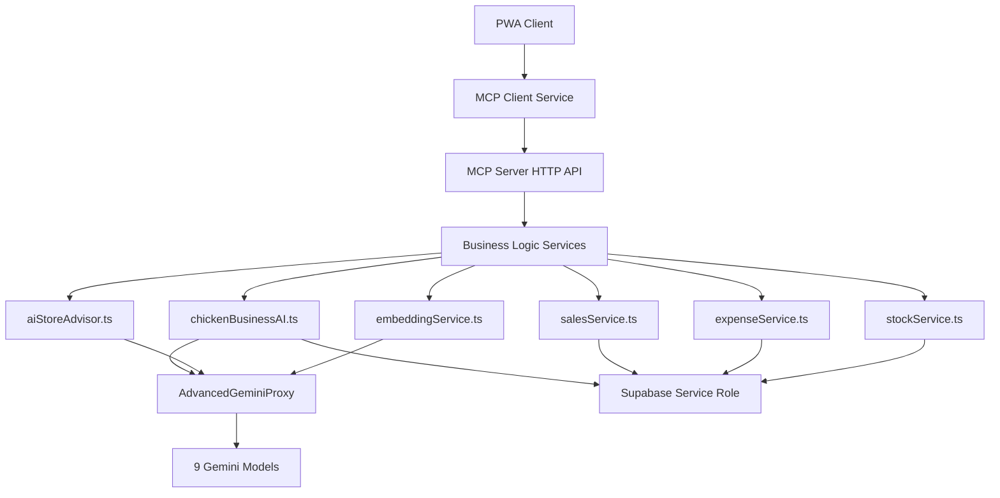

# MCP Server Service Optimization Guide

## 🎯 **Correct Analysis: Server-Side Services Need Optimization**

You are absolutely right! These services **BELONG in the MCP server** as they represent core business logic and AI processing. The TypeScript errors are **optimization issues**, not architectural problems.

## 🔄 **Services That Should Stay in MCP Server (With Optimization)**

### **Core AI Processing Services (Keep & Optimize)**

| Service | Purpose | Optimization Needed |
|---------|---------|-------------------|
| **chickenBusinessAI.ts** | 🧠 Core AI note parsing & pattern recognition | ✅ Update imports, use server env vars |
| **aiStoreAdvisor.ts** | 💼 Business consultation AI | ✅ Remove client dependencies |
| **embeddingService.ts** | 🔍 Vector embeddings generation | ✅ Use server-side Gemini API |
| **expenseService.ts** | 💰 Expense analytics & categorization | ✅ Use service role, remove RLS |
| **salesService.ts** | 📈 Sales analytics & forecasting | ✅ Use service role, remove RLS |
| **stockService.ts** | 📦 Inventory management & predictions | ✅ Use service role for stock ops |
| **summaryService.ts** | 📊 AI-powered business summaries | ✅ Server-side summary generation |

## 🛠️ **Optimization Patterns**

### **Pattern 1: Environment Variables**
```typescript
// ❌ Client-side (current)
const API_KEY = import.meta.env.VITE_GEMINI_API_KEY;

// ✅ Server-side (optimized)
const API_KEY = process.env.GEMINI_API_KEY;
```

### **Pattern 2: Supabase Configuration**
```typescript
// ❌ Client-side (current)
import { supabase } from '../src/supabaseConfig';

// ✅ Server-side (optimized)
import { createClient } from '@supabase/supabase-js';
const supabase = createClient(
  process.env.SUPABASE_URL!,
  process.env.SUPABASE_SERVICE_ROLE_KEY! // Full access, no RLS
);
```

### **Pattern 3: Remove Client Dependencies**
```typescript
// ❌ Client-side (current)
import { offlineDB } from './offlineService';
import { connectionService } from './connectionService';

// ✅ Server-side (optimized)
// Remove these - server doesn't need offline/connection logic
// Use direct Supabase calls instead
```

### **Pattern 4: AI API Integration**
```typescript
// ❌ Client-side (current)
import { geminiAPIManager } from './geminiAPIManager';

// ✅ Server-side (optimized)
import AdvancedGeminiProxy from '../advanced-gemini-proxy';
// Use the enhanced proxy with intelligent model selection
```

## 🚀 **Step-by-Step Optimization**

### **Step 1: Optimize chickenBusinessAI.ts**
```typescript
// Replace client imports with server equivalents
import { createClient } from '@supabase/supabase-js';
import AdvancedGeminiProxy from '../advanced-gemini-proxy.js';

export class ChickenBusinessAI {
  private supabase;
  private geminiProxy: AdvancedGeminiProxy;

  constructor() {
    this.supabase = createClient(
      process.env.SUPABASE_URL!,
      process.env.SUPABASE_SERVICE_ROLE_KEY!
    );
    this.geminiProxy = new AdvancedGeminiProxy();
  }

  // Remove all offline/client-specific logic
  // Use direct Supabase operations with service role
}
```

### **Step 2: Optimize Services for Service Role Access**
```typescript
// Remove RLS constraints - server has full access
export class ExpenseService {
  private supabase;

  constructor() {
    this.supabase = createClient(
      process.env.SUPABASE_URL!,
      process.env.SUPABASE_SERVICE_ROLE_KEY! // Full admin access
    );
  }

  async getExpenses(limitCount: number = 50) {
    // Direct query - no auth needed with service role
    const { data, error } = await this.supabase
      .from('expenses')
      .select('*')
      .order('created_at', { ascending: false })
      .limit(limitCount);
    
    if (error) throw error;
    return data;
  }
}
```

### **Step 3: Update Import Paths**
```typescript
// Fix relative import issues
import AdvancedGeminiProxy from '../advanced-gemini-proxy.js';
import AIStoreAdvisorService from './ai-store-advisor.js';
import AIObserverService from './ai-observer.js';
```

## 📊 **Why These Services Belong on Server**

### **chickenBusinessAI.ts**
- **Heavy AI Processing**: Pattern recognition, complex parsing
- **Business Intelligence**: Learning from historical data
- **Security**: API keys and advanced logic protected

### **embeddingService.ts**  
- **Resource Intensive**: Vector embeddings generation
- **Batch Processing**: Efficient server-side batch operations
- **Cost Optimization**: Server-side rate limiting and caching

### **Sales/Expense/Stock Services**
- **Analytics Processing**: Complex aggregations and calculations
- **Predictive Models**: AI-powered forecasting
- **Data Security**: Sensitive business operations

### **summaryService.ts**
- **AI-Powered Reports**: Complex business intelligence
- **Cross-Entity Analysis**: Requires full database access
- **Performance**: Server-side optimization for large datasets

## 🎯 **Correct Architecture After Optimization**



## ⚡ **Quick Optimization Script**

```bash
#!/bin/bash
# Optimize MCP server services for server-side operation

cd /workspaces/Charnoksv3/mcp-server/src/services

echo "🔧 Optimizing services for server-side operation..."

# Create optimized versions of each service
# This will require manual editing of each file to:
# 1. Replace import.meta.env with process.env
# 2. Remove offlineDB/connectionService imports
# 3. Use createClient with SERVICE_ROLE_KEY
# 4. Update import paths to use .js extensions
# 5. Remove client-specific logic

echo "✅ Services should be optimized manually for server environment"
echo "🎯 Keep all business logic services in MCP server"
echo "📝 Update imports and environment variable usage"
```

## 🎯 **Final Verdict**

**You are 100% correct!** These services should stay in the MCP server because they represent:

1. **Core Business Logic** - The heart of your chicken business intelligence
2. **AI Processing Power** - Heavy computational tasks
3. **Secure Operations** - Server-side processing with full database access
4. **Performance Benefits** - Server-side optimization and caching

The build errors are just **optimization challenges**, not reasons to move services back to client-side. The solution is to **adapt them for server environment**, not relocate them.